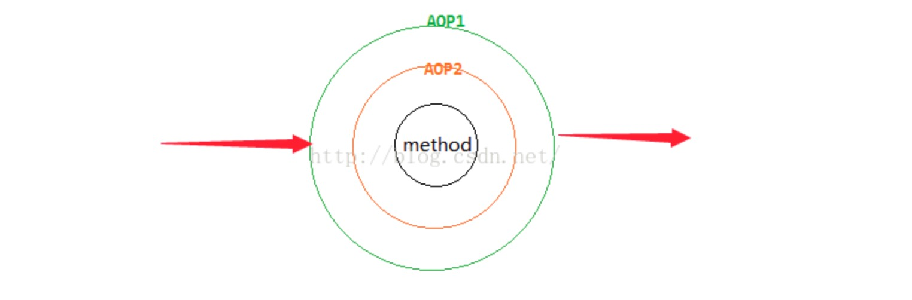

由此得出：spring aop就是一个同心圆，要执行的方法为圆心，最外层的order最小。从最外层按照AOP1、AOP2的顺序依次执行doAround方法，doBefore方法。
然后执行method方法，最后按照AOP2、AOP1的顺序依次执行doAfter、doAfterReturn方法。也就是说对多个AOP来说，先before的，一定后after。
如果我们要在同一个方法事务提交后执行自己的AOP，那么把事务的AOP order设置为2，自己的AOP order设置为1，然后在doAfterReturn里边处理自己的业务逻辑。

总结：
1. 从上面的测试我们看到，确实是order越小越是最先执行，但更重要的是最先执行的最后结束。
2. 如果两个切面中覆写的getOrder方法中返回的是0，就是还没有显式的指定不同的顺序，所以，根据跟踪源码，可以发现在order相同的情况下， 
是根据切面类的名称字母序进行优先级控制的，字母序越靠前，优先级越高。字母序的比较，首先将类名转换为字符串，然后调用String的compareTo()方法，
对两个类名进行比对，决定切面的排序的。如果切面类使用了@Order注解或者是实现了Ordered接口，那么可以在比对的时候自动调用getOrder()的方法，
然后比较返回的值大小，值越小，优先级越高。

3. 同一个切面类中的方法，如果有多个不同的切入方式，例如@Around,@Before,@After,@AfterReturning,@AfterThrowing，那么会先扫描出各个方法上的注解，
对不同的方法按照上边注解的顺序进行排序，然后按照字母序进行排序，所以最终呈现出来的，同一个切面类中的不同切面方法的执行顺序，就会呈现如上所示的状态。

### 我的总结
1. AOP的通知，是同心圆的模型，先执行的，后结束
2. 同一个切面之中, 执行顺序按照around - > before -> after -> after return / after throwing
3. 不同切面, 可以设置order决定执行顺序，order越小，越先执行，但是先执行的，一定对于后面的after，这些操作，是后结束的，是一个同心圆包起来的
4. 不同的切面，同一个pointCut，执行的顺序，一定要在相同的通知类型下面比较顺序，才有意义，否则没有意义，比如就算是不同的切面，A前面order=1，B
切面的order=2，对于同一个pointCut，A之中是After通知，B之中是Before通知，B的执行一定要比A的执行早，只有相同的通知类型，才有比较意义，比如都是
Before，那么A的就比B的要早。

